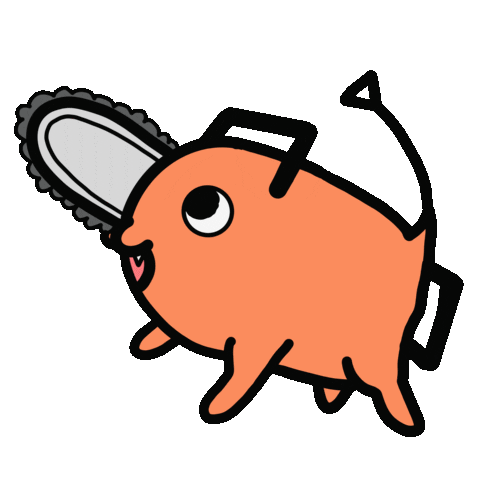
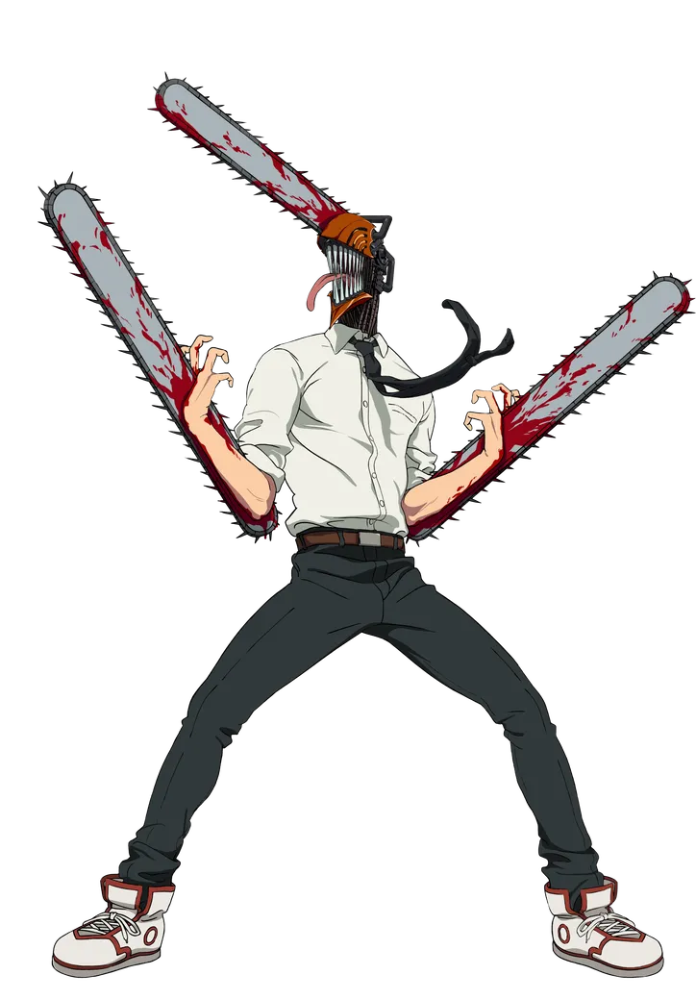
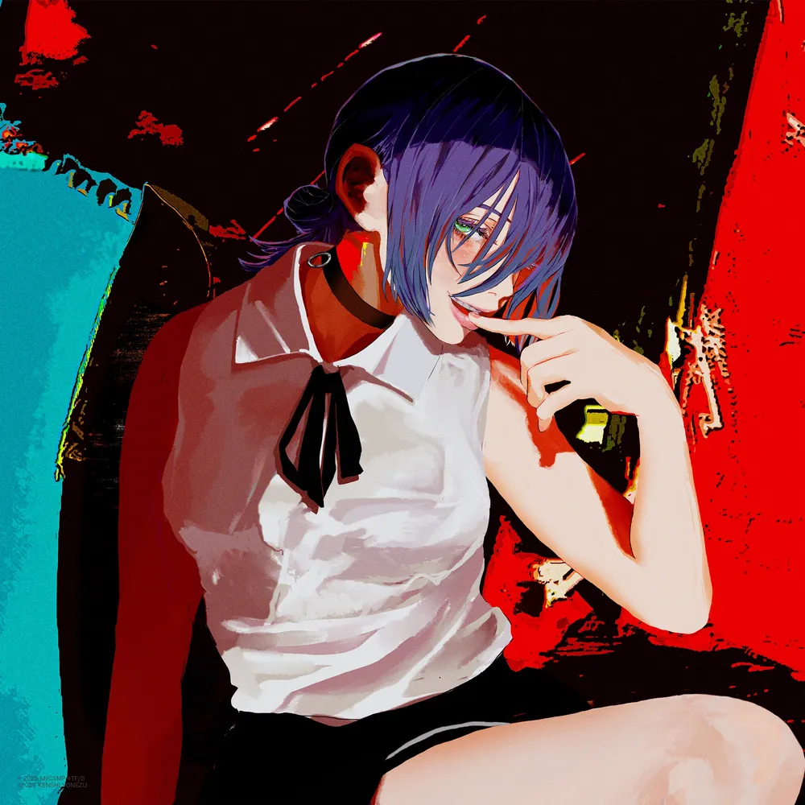
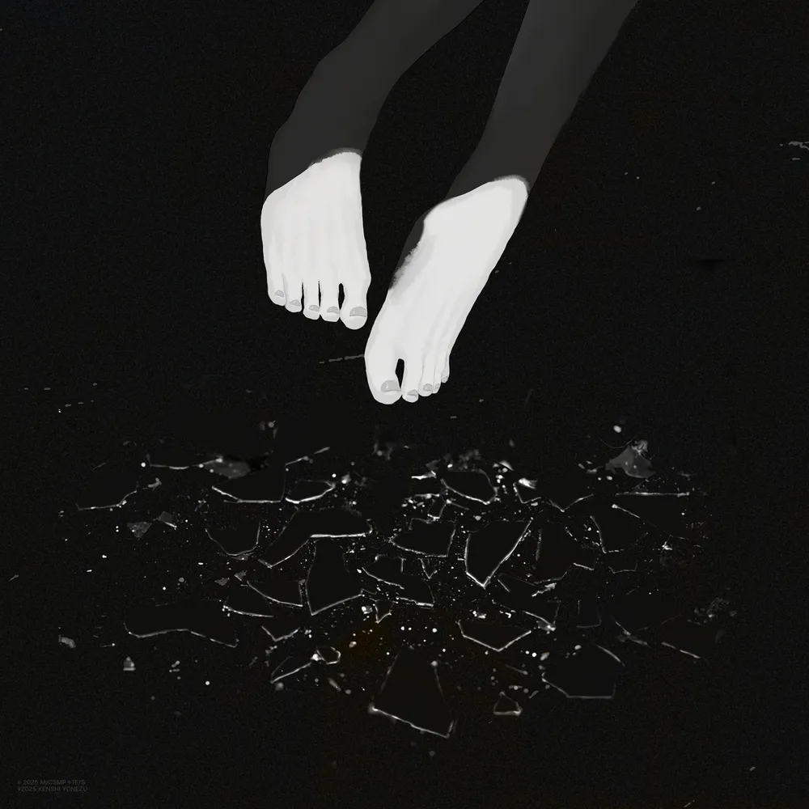
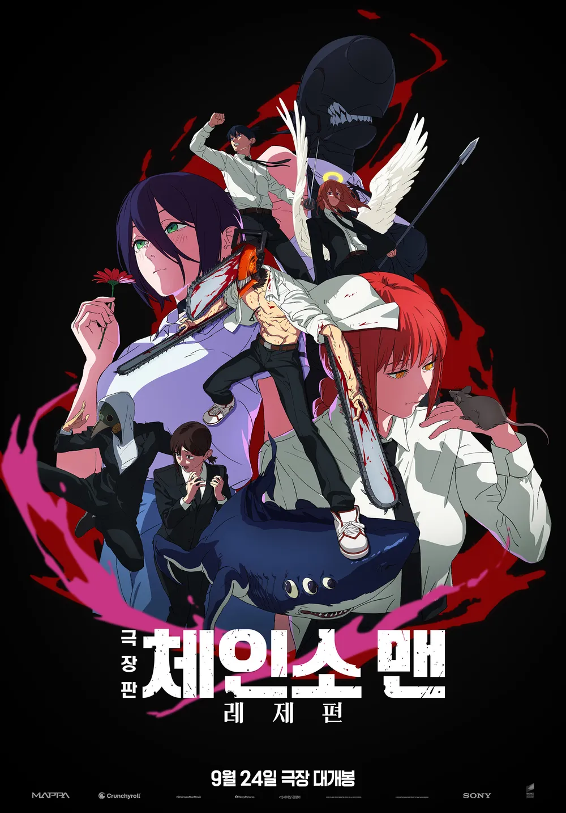
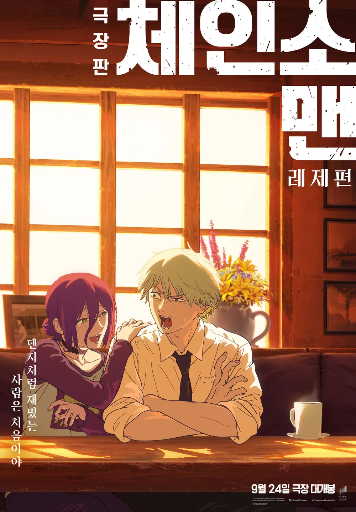

<h1 style="font-weight:900; margin: 0 0 12px 0;">극장판 체인소 맨: 레제편 홍보 웹사이트 프로젝트 최종 결과 보고서</h1>

작성일: 2025년 12월 19일

<h2 id="toc" style="font-weight:800; margin: 24px 0 10px 0;">목차</h2>

1. <a href="#section-1">프로젝트 최종 개요</a>
2. <a href="#section-2">구현 완료 기능 상세 분석</a>
3. <a href="#section-3">디자인 시스템 및 스타일 가이드</a>
4. <a href="#section-4">기술적 최적화 및 안정성</a>
5. <a href="#section-5">최종 평가 및 유지보수 가이드</a>

<h2 id="section-1" style="font-weight:800; margin: 26px 0 10px 0;">1. 프로젝트 최종 개요</h2>

<h3 style="font-weight:700; margin: 14px 0 8px 0;">1.1 목적과 최종 디자인 컨셉</h3>

본 프로젝트는 "극장판 체인소 맨: 레제편" 홍보를 위한 인터랙티브 웹사이트 구축을 목적으로 한다.
"폭발 같은 여름, 소년과 소녀의 이야기"라는 핵심 문장을 기반으로, 검정 배경 위에 오렌지와 퍼플 계열의 고대비 포인트를 배치해 강렬하고 선명한 인상을 목표로 했다.

<h3 style="font-weight:700; margin: 14px 0 8px 0;">1.2 첫인상 구성 (로더 및 히어로)</h3>

초기 진입 시 로더에서 포치타 GIF가 노출되고, 이후 히어로 섹션에서 유튜브 예고편을 배경으로 자동 재생하여 "영상을 중심으로 시작되는" 구조를 만든다.

로더에서 사용되는 포치타 GIF

<h2 id="section-2" style="font-weight:800; margin: 26px 0 10px 0;">2. 구현 완료 기능 상세 분석</h2>

<h3 style="font-weight:700; margin: 14px 0 8px 0;">2.1 등장인물 섹션</h3>

등장인물 섹션은 수평 스크롤 리스트와 상세 모달로 구성된다.

- 카드 리스트는 마우스 위치에 따라 좌우 자동 스크롤 속도를 조절한다. 중앙 영역에서는 정지하고, 좌우 가장자리 영역에서만 이동하여 사용자가 의도적으로 탐색하도록 설계했다.
- 각 카드는 호버 시 확대 및 Y축 이동을 적용하여 클릭 가능성을 명확히 한다.
- 카드의 이미지 컨테이너를 고정 높이로 유지하고 `align-items: flex-end`를 적용해 하단 기준 정렬을 맞춘다.
- 이미지 표시에는 `object-fit: contain`을 사용하고 캐릭터별로 `transform: scale(...)` 값을 다르게 적용해 잘림 없이 화면을 채운다.

상세 모달은 선택한 캐릭터의 이미지와 설명을 좌우 2열 레이아웃으로 제공한다.

- 성우 표기는 캐릭터명 옆에 "(V. 성우명)" 형식으로 노출한다.
- 변신 가능 캐릭터는 이미지 배열 길이를 기준으로 "악마화" 버튼을 조건부 렌더링한다.
- "악마화" 버튼은 검정 배경 + 오렌지 테두리(`2px solid #f97316`) 조합으로 시각적 대비를 확보한다.

    
    

등장인물 섹션에서 사용하는 덴지 기본 이미지와 변신 이미지

<h3 style="font-weight:700; margin: 18px 0 8px 0;">2.2 OST 플레이어</h3>

OST 섹션은 유튜브 IFrame API 기반의 커스텀 플레이어이며, LP 턴테이블 메타포로 인터랙션을 구성한다.

- 유튜브 API는 `window.YT.Player`로 로딩되며, 화면에 보이지 않는 플레이어를 생성해 오디오 재생을 담당한다.
- 재생 상태에 따라 LP 원판 요소의 애니메이션 재생 여부를 전환한다. 구현은 `animationPlayState: running | paused` 방식이다.
- 재생 및 일시정지 버튼은 SVG 아이콘을 사용해 상태 전환을 명확히 하고, 트랙별 포인트 컬러를 fill로 적용한다.
- 진행 바는 `input[type="range"]`를 커스텀 스타일링하여 재생 비율만큼 트랙 컬러가 채워지도록 구성한다.
- 커버 이미지는 트랙 데이터의 `cover` 경로를 사용하며, 커버 클릭 시 원본 유튜브 링크로 이동한다.

    
    

OST 섹션에서 사용하는 커버 이미지

<h3 style="font-weight:700; margin: 18px 0 8px 0;">2.3 포스터 갤러리</h3>

포스터 섹션은 프로젝트에 포함된 포스터 리소스를 그리드로 배치하고, 클릭 시 라이트박스 모달로 확대하는 구조다.

- 포스터 데이터는 배열로 관리되며, 각 항목은 title과 src를 가진다.
- 그리드는 `repeat(auto-fill, minmax(250px, 1fr))`로 화면 폭에 따라 자동으로 열 개수가 변화한다.
- 라이트박스 모달은 좌우 네비게이션 버튼을 제공하고, 이미지 최대 폭을 `calc(100vw - 150px)`로 제한하여 버튼과 콘텐츠가 충돌하지 않게 한다.

    
    

포스터 섹션에서 사용되는 이미지 예시

<h3 style="font-weight:700; margin: 18px 0 8px 0;">2.4 예고편 갤러리</h3>

예고편 섹션은 유튜브 썸네일 그리드와 확대 모달로 구성된다.

- 그리드 항목 클릭 시 선택된 영상이 상태로 저장되고, 모달에서 유튜브 임베드가 재생된다.
- 모달 내 좌우 화살표 버튼을 고정 위치에 배치하되, 영상 영역은 `maxWidth: calc(90vw - 150px)`로 제한하여 화살표 클릭 안전 영역을 확보한다.
- 모달 내부 컨테이너는 `aspect-ratio: 16 / 9`로 비율을 고정해 레이아웃 점프를 방지한다.

<h3 style="font-weight:700; margin: 18px 0 8px 0;">2.5 네비게이션 (하단 Dock UI)</h3>

하단 Dock은 마우스 위치와 각 아이템 중심점의 거리를 기반으로 크기를 보간한다.

- `framer-motion`의 `useMotionValue`와 `useTransform`으로 거리 기반 값을 만들고, `useSpring`으로 부드러운 확대 및 축소를 구현한다.
- Dock 컨테이너 자체도 호버 시 높이가 커지도록 설계하여 사용자가 조작 중임을 명확히 한다.
- 클릭 시 `scrollIntoView({ behavior: 'smooth' })`로 해당 섹션으로 이동한다.

<h3 style="font-weight:700; margin: 18px 0 8px 0;">2.6 사용자 경험(UX) 개선</h3>

모든 확대 모달(등장인물, 예고편, 포스터)에서의 사용자 편의성을 강화했다.

- **닫기 버튼 추가**: 모달 우측 상단에 명확한 닫기 버튼(X)을 배치하여, 외부 영역 클릭 외에도 직관적인 종료 방법을 제공한다.
- **커서 가시성 확보**: 커서의 `z-index`를 최상위로 조정하여, 확대된 모달 위에서도 커서 위치를 명확히 파악할 수 있도록 개선했다.

<h2 id="section-3" style="font-weight:800; margin: 26px 0 10px 0;">3. 디자인 시스템 및 스타일 가이드</h2>

<h3 style="font-weight:700; margin: 14px 0 8px 0;">3.1 컬러</h3>

컬러 시스템은 검정 배경을 기반으로 오렌지 포인트와 퍼플 보조색을 함께 사용한다.

- 배경: `#000000`, `#0a0a0a`
- 오렌지 포인트: `#f97316` (버튼, 테두리, 강조 텍스트)
- 퍼플 계열: `#c4b5fd`, `#a78bfa` (본문 및 보조 강조)

특히 재생 버튼과 같은 핵심 CTA는 검정 배경에 오렌지 테두리를 사용해 어두운 배경에서도 즉시 인지되도록 했다.

<h3 style="font-weight:700; margin: 14px 0 8px 0;">3.2 폰트 및 두께</h3>

타이포그래피는 나눔고딕 기반의 한글 가독성과 굵기 레이어링을 중심으로 구성했다.

- 본문: 나눔고딕 `400` 중심
- 제목: `700` 이상으로 단계적 강조
- 숫자 및 타이머 표기: 필요한 구간에서 `700` 이상 적용하여 시인성 확보

<h2 id="section-4" style="font-weight:800; margin: 26px 0 10px 0;">4. 기술적 최적화 및 안정성</h2>

<h3 style="font-weight:700; margin: 14px 0 8px 0;">4.1 커서 추적 안정화</h3>

커서 팔로워는 `translate3d(x, y, 0)`로 위치를 갱신하여 하드웨어 가속을 유도하고 잔상 및 딜레이 체감을 줄였다.

<h3 style="font-weight:700; margin: 14px 0 8px 0;">4.2 레이아웃 안정성</h3>

- 캐릭터 리스트는 Flexbox 하단 정렬로 카드별 높이가 달라도 이름 라인이 흐트러지지 않도록 구성했다.
- 이미지 잘림 방지를 위해 투명 배경 리소스에 `object-fit: contain`을 사용하고, 컨테이너에 여유 높이와 `overflow: hidden`을 적용했다.
- 모달 레이아웃은 최대 폭을 제한하여 좌우 네비게이션 버튼과 충돌하지 않게 했다.

<h3 style="font-weight:700; margin: 14px 0 8px 0;">4.3 로딩 및 리소스</h3>

- 이미지에는 `loading="lazy"`를 적용해 초기 렌더 부담을 줄였다.
- 섹션 컴포넌트는 `lazy` 및 `Suspense`로 분할 로딩하여 최초 진입 시 대기 시간을 줄이는 구조다.

<h2 id="section-5" style="font-weight:800; margin: 26px 0 10px 0;">5. 최종 평가 및 유지보수 가이드</h2>

<h3 style="font-weight:700; margin: 14px 0 8px 0;">5.1 확장성 평가</h3>

데이터 배열 기반 설계로 확장성이 높다.

- 등장인물: `CHARACTERS` 배열에 항목 추가 시 카드 및 모달이 자동 확장된다.
- OST: `OST_DATA`에 트랙을 추가하면 LP 플레이어 구성이 동일한 패턴으로 확장된다.
- 포스터: `POSTERS` 배열 추가로 갤러리 그리드와 라이트박스 네비게이션이 자동 확장된다.

<h3 style="font-weight:700; margin: 14px 0 8px 0;">5.2 유지보수 가이드</h3>

- 이미지 경로는 `public/assets/images` 하위에서 관리하고, 컴포넌트는 `import.meta.env.BASE_URL`을 통해 배포 경로 차이를 흡수한다.
- 신규 캐릭터 추가 시 권장 순서: 이미지 추가, `CHARACTERS`에 id 및 이미지 배열 추가, 필요한 경우 개별 `scale` 규칙 보정.
- 신규 포스터 추가 시 권장 순서: 파일을 `public/assets/images/posters`에 추가, `POSTERS` 배열에 title과 src 추가.

